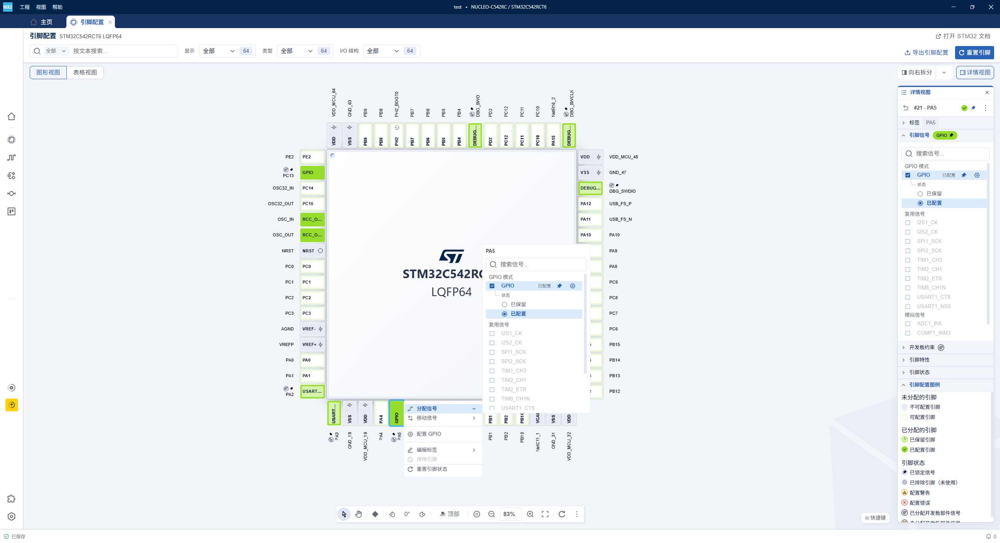

# STM32CubeMX2 中文汉化工具

非官方社区工具，用于给 **STM32CubeMX2**（Electron/Theia）添加中文界面。

v0.2.0 把汉化机制从「字节级字面量替换」换成了
**「Theia i18n 注入 + DOM 兜底」**：模块划分、备份回滚、词典与翻译表流程全部沿用，
只替换落地方式。机制调查与注入点清单见
[docs/I18N-STRATEGY.md](docs/I18N-STRATEGY.md)。

> v0.2.0 起**只保留 i18n 注入这一条路径**，v0.1.x 的字面量字节替换
> （`core/patcher.py`、`--strategy literal`）已移除。词典格式没变，
> 老版本 EXE 与新版本共用同一份 `dict/localization.json`。

> 本项目与 STMicroelectronics 无隶属或背书关系，不包含 STM32CubeMX 本体。
> 使用本工具修改第三方软件可能违反其许可协议，风险自负，建议仅用于个人学习与本地界面理解。

[](https://github.com/P1nkDog/STM32CubeMX2-Chinese/releases)
[](https://github.com/P1nkDog/STM32CubeMX2-Chinese/actions)
[](https://www.python.org/)
[](https://www.microsoft.com/windows)

## 功能特性

- 一键汉化 / 一键回滚
- **i18n 注入**：改 10 个 bundle 的 5 类锚点，一次覆盖全部走框架 i18n 的文案
- **DOM 兜底**：追加式挂一个整串精确匹配的翻译器，覆盖 ST 自绘界面的裸字符串
- **注入点自检**（`--probe`）：锚点唯一性校验，失配拒绝注入，绝不写坏文件
- **语法门禁**：落盘前先用 `node --check` 校验，不通过就整文件不写
- **覆盖率评估**（`--coverage`）：按 i18n 调用点统计命中率并列出未覆盖文案
- 词典在线更新 / 软件更新 / 环境检查 / 锚点自检 / 覆盖率评估
- 术语保留：GPIO、DMA、NVIC、EXTI、SPI、CMSIS、Pack、MCU 等专有名词保留英文

## 效果预览

汉化后的 STM32CubeMX2 工程编辑界面：



## 已验证环境

| 项目 | 版本 |
|------|------|
| STM32CubeMX2 | 1.1.1 |
| 工具 / 词典 | v0.2.0 |

## 快速开始

### 方式一：下载 EXE（推荐）

1. 前往 [Releases 发布页](https://github.com/P1nkDog/STM32CubeMX2-Chinese/releases) 下载最新版 EXE。
2. **完全退出 STM32CubeMX2**（含系统托盘图标）。
3. 双击运行程序，主菜单选择 `2) 一键汉化`。
4. 启动 STM32CubeMX2 查看中文界面。想还原时再次运行并选择 `3) 一键回滚`。

### 方式二：源码运行

```powershell
cd STM32CubeMX2-Chinese
python main.py
```

需要 Python 3.11+（仅标准库，无第三方依赖）。
`node` 用于落盘前的语法门禁，缺失时会跳过该校验（建议安装）。

## 使用说明

### 交互菜单

| 选项 | 功能 |
|------|------|
| 1) 环境/安装检查 | 检测安装目录、进程、词典与汉化状态 |
| 2) 一键汉化 | 备份后注入 i18n 语言包（语法门禁通过才落盘） |
| 3) 一键回滚 | 从 `.orig` 备份恢复原版文件（含 `bundle.js.gz`） |
| 4) 词典更新 | 从 GitHub 拉取最新词典 |
| 5) 软件更新 | 用默认浏览器打开 GitHub Releases 发布页 |
| 6) 高级 | 导出词典 / 导入修改后的词典 |

### 高级菜单（主菜单选 6 进入）

| 选项 | 功能 |
|------|------|
| 1) 导出词典 | 把当前生效的词典写成一个可编辑的 JSON 文件，并打印路径 |
| 2) 导入修改后的词典 | 校验 + 术语门禁，通过后固化进仓库 `dict/`（仅源码模式需要） |

> **EXE 用户改完词典不需要选 2。** 你编辑的那份工作副本本来就被优先读取，
> 改完直接回主菜单选「2) 一键汉化」就生效。「导入」只服务于「把改动固化进仓库、
> 好提交 PR」这一个源码场景。

### 命令行参数

诊断类（锚点自检、覆盖率）走命令行，不进菜单 —— 它们是维护者动作，
普通用户不需要为「界面还有英文」跑统计：

| 参数 | 说明 |
|------|------|
| `-g, --path <目录>` | 指定 CubeMX2 安装目录（指到 `dist`/`app` 那一层也行，会自己找到根） |
| `--patch` | 执行汉化（免菜单） |
| `--rollback` | 一键回滚 |
| `--probe` | 注入点锚点自检（应用开着也能跑） |
| `--coverage` | 覆盖率评估并列出未覆盖文案 |
| `--doctor` | 环境/安装检查 |
| `-v, --verbose` | 打出细节：锚点命中明细、术语门禁的通过项、源串长度统计 |
| `--export-dict` | 导出词典到工作副本，供手工编辑 |
| `--import-dict` | 把工作副本词典导回仓库 `dict/`（提交前） |
| `--update-dict` / `--check-update` | 从 GitHub 拉取最新词典并应用 |
| `--open-github` | 打开 GitHub Releases 发布页（软件更新） |
| `--version` | 显示版本号 |

> **没有「构建语言包」这一步了。** v0.2.0 起词典本身就是一张扁平的
> `{英文原文: 中文}` 表，`--patch` 每次从它现场构建注入内容。
> 以前那种「改了词典却忘了 `--build-langpack`，于是汉化静默无效」的坑从结构上消失了。
>
> 同时删掉的还有 `--build-langpack` / `--export-csv` / `--import-csv` / `--dry-run`。
> `--dry-run` 是 `--probe` + `--coverage` 的合体，零独有信息，还要把 87MB 的 bundle 读三遍。
> `--export-csv` / `--import-csv` 被 `--export-dict` / `--import-dict` 取代 ——
> 词典本身就是扁平表，不再需要 CSV 这个中间格式。
>

### 安装目录是怎么找到的

按这个顺序，第一个验真成功的就用：

| 顺序 | 来源 | 说明 |
|------|------|------|
| 1 | `-g <目录>` | 指到 `dist`、`app`、甚至 `bundle.js` 都行，会自己往上找到根 |
| 2 | 上次确认的 | `~/.stm32cubemx2-chinese/config.json`，只在**你亲手给过**之后才有 |
| 3 | 自动扫描 | 环境变量 `STM32CUBEMX2_PATH` → 系统卸载表 → 常见安装位置 |
| 4 | 问你要 | 以上全空时，控制台会让你输入安装目录 |

三条设计约束值得单独说：

- **判据只有一条**：目录里得有
  `resources/stm32cubemx-application/<版本>/dist/resources/app/lib/frontend/bundle.js`。
  中间那段版本号用通配，所以应用升级不会让整套定位失效。
- **自动扫描绝不翻盘乱搜**。它只看「明确算出来的位置」本身和它的祖先链；
  往子目录里搜只在**你手动给出路径之后**才开，而且搜出来的结果必须你回 `y`
  才采用 —— 认错目录的后果是往别的程序里写文件，这是唯一有实际危害的失误面。
- **记忆只存你确认过的**。自动扫描的唯一命中不写进去（实测扫一轮不到
  0.1 秒，记下来反而会把一次偶然的误判固化）。每次读回都要重新验真，
  目录被挪走或删掉就静默回退到扫描。

扫描失败时工具分三种情况告诉你，而不是一句「未找到」：注册表里**有** CubeMX2
但给出的目录不可用（会把它读到的 `InstallLocation` 原样列出来，方便远程排障）、
只找到**老版** STM32CubeMX（Java 版，本工具不支持）、以及**根本没有**安装痕迹。

## 汉化策略

界面文案其实分两套，所以有**两条通道**：

| 通道 | 覆盖对象 | 做法 |
|------|------|------|
| **i18n 通道**（主力） | 框架文案（菜单、命令面板、设置项…）走 `nls.localizeByDefault` 的那部分 | 把 `{英文原文: 中文}` 写进框架的 `localization.replacements` |
| **DOM 通道**（兜底） | ST 自己写的界面文案（Pinout 主界面、状态栏…）—— 它们**是裸字符串，一次 i18n 都没调用** | 在 bundle 末尾追加一个翻译器，渲染后按**整串精确匹配**替换文本与 `placeholder`/`title` 等属性 |

> 只走 i18n 通道的话，能在前端 bundle 里落地的条目只剩一半上下（1186 对 1629）——
> 剩下那些裸字符串通道天生够不到，这就是「菜单变中文了但主界面还是英文」的原因。

i18n 通道的注入点（全部用正则锚点定位，实测每条唯一命中）：

| 锚点 | 文件 | 作用 |
|------|------|------|
| `fallback` | 10 个 bundle | `localizeByDefault` 反查不到 key 时不再直接返英文 |
| `tail` | 10 个 bundle | 装载语言包并把 locale 设为 zh-cn（并把表挂到 `window` 给 DOM 通道用） |
| `packkeep` | `bundle.js` | 语言包到达时合并而非覆盖 `replacements` |
| `zhpack` | `main.js` | 把框架自带 zh-cn 包标记为 `languagePack` |
| `dom`（DOM 通道） | 3 个前端 bundle | 末尾追加 DOM 兜底翻译器（**追加式，无锚点**） |

**为什么要注入 10 个文件**：每一份自带 nls 模块的 bundle 都是一条独立通道。
`lib/frontend/778.js` 这个懒加载 chunk 里有一份**独立**的 nls；
`scripts/theia-electron-main.js` 结尾是 `require('../lib/backend/electron-main.js')`，
它才是 Electron 主进程真正入口（`main.js` 只是后端服务进程）。
`python main.py --probe` 会把每个文件的锚点命中数列出来。

实测覆盖率（按 i18n 调用点统计，共 10 个文件）：

| 文件 | i18n 字面量 | 语言包命中 | 命中率 |
|------|------|------|------|
| `lib/frontend/bundle.js` | 2370 | 1531 | 65% |
| `lib/frontend/secondary-window.js` | 1900 | 1205 | 63% |
| `lib/frontend/778.js` | 90 | 43 | 48% |
| `lib/backend/main.js` | 654 | 498 | 76% |
| 其余 6 个后端/主进程 bundle | 430 | 208 | 48% |
| **合计** | **5444** | **3485** | **64%** |

词典的落地通道分三类：走 i18n 调用点的、只以裸字符串出现（靠 DOM 通道接住的）、
以及在 10 个 bundle 里根本搜不到的**运行时数据**（来自设备/配置描述符，
只能靠界面上的收集器 `__cubemx2zhMiss()` 采）。三类的实时条数跑 `--coverage` 看，
不要往文档里抄死数字。

> 框架自带的 zh-cn 包经实测有 1293 条，但全部是 Theia 自身
> （AI / notebook / terminal / vsx）的显式键文案，**不含 VS Code 工作台文案**。
> 开启它仍是净赚，但主力是自建语言包。

DOM 通道的安全边界（宁可少翻，不可翻错）：只做整串精确匹配、不碰 `value`、
跳过编辑器/终端/构建输出/可编辑区、`data-cubemx2zh-skip` 可让任意元素退出翻译。
细节见 [docs/I18N-STRATEGY.md](docs/I18N-STRATEGY.md) 第 9 节。

## 更新

- **词典更新**（菜单 4 / `--update-dict`）：从 GitHub 拉取最新 `localization.json`，
  写入工具旁（或 `%LOCALAPPDATA%`）。更新后直接执行「一键汉化」即可生效。

  > 这份远程词典会**整份覆盖**你手改的那份工作副本（它就是被优先读取的那份），
  > 不是合并。改过词典又想留着自己的译法，就先复制一份备份，或在提示出现时选 N。
  > 工具会在下载前打印覆盖提示和具体路径，但不会替你备份。
- **软件更新**（菜单 5 / `--open-github`）：打开 GitHub Releases 发布页，自行下载新版 EXE。

> 远程地址由 `core/dictionary.py` 中的 `GITHUB_REPO` 决定（当前：`P1nkDog/STM32CubeMX2-Chinese`）。

## 安全机制

- **自动备份**：改动前把原文件备份为 `*.orig`（仅首次备份，不覆盖，`bundle.js.gz` 同样备份）。
- **锚点唯一性**：每条注入的正则必须恰好命中 1 次，否则拒绝注入。
- **幂等重建**：重复汉化等价于「从 `.orig` 基线重新注入」，翻译更新后重跑即可。
- **语法门禁**：先写临时文件 → `node --check` → 通过才落盘；失败则原文件不受影响。
- **术语门禁**：落盘前核对译法与 `rules/glossary.zh.json`（对齐 ST 官方中文用词），
  不一致直接中止、零写入。**全过时一行都不打** —— 门禁是保险不是日报，它一开口
  就说明有东西要处理；想确认它跑过就加 `-v`。
- **逐文件隔离**：一个文件失败只回滚该文件，不牵连其它。
- **进程检测**：汉化/回滚前检测 CubeMX2 是否在运行。
- **定位门禁**：往子目录里搜出来的安装目录必须用户确认才采用；记住的安装目录
  每次读回都重新验真，对不上就回退到扫描（详见「安装目录是怎么找到的」）。
- **四层验证**：改完生成器先跑离线语法自检，落盘后跑 i18n 通道语义自检与
  DOM 通道真实 DOM 自检，最后用框架**真实代码**做端到端验证（见下节）。
- **未收录即原文**：语言包里没有的英文原样显示，不会误改（不像字节替换会误伤）。
- **回滚字节级还原**：实测 10 个 bundle + 2 个 `.gz` 回滚后 sha1 与 `.orig` 完全一致。

## 参与翻译

**只是想把某个词改得顺一点？** 运行程序 → `6) 高级` → `1) 导出词典`，
它会告诉你文件路径；用记事本打开，在 `entries` 里改对应的中文（或加一行），保存，
回主菜单选 `2) 一键汉化` 即可 —— 不需要导回，也不需要装 Python 之外的任何东西。

词典最开始是由 AI 大模型翻译的，为了更加精准的翻译，需要社区协作维护，
完整教程见：[docs/TRANSLATION.md](docs/TRANSLATION.md)。核心流程：

```
--export-dict 导出工作副本 -> 编辑 entries（英文原文: 中文）
  -> --import-dict 导回仓库 -> --patch 汉化验证 -> 提交 Pull Request
```

也可以用两个工具直接导出**当前未覆盖**的文案，比全量扫字典更聚焦：

```bash
python tools/dump_missing.py       -g <安装目录>   # 走了 i18n 但包里没有的 -> missing.csv
python tools/scan_bare_ui_text.py  -g <安装目录>   # 界面裸字符串缺口     -> bare-missing.csv
```

两者覆盖的是**不同的文案来源**，都要看：

| 类别 | 例子 | 为什么漏 | 补在哪 |
| --- | --- | --- | --- |
| 走了 i18n 但包里没有 | `Remove Breakpoint`、`Edit Keybinding...` | 词典只覆盖之前扫到的那些 | `dict/localization.json` 的 `entries` |
| 运行时数据（源码里搜不到） | `General information`、`Software layer` | 来自设备/配置描述数据，不在任何 js 里 | `dict/localization.json` 的 `entries` |
| 被拆开的句子里的短片段 | `Hold`、`Press any of`、`Mouse wheel` | 一句话被 React 拆成多个文本节点 | `assets/dom-translate.js` 的 `SCOPE_MAP` |
| 句子读起来别扭（词都译了但不成话） | `按住 空格 移动鼠标时按住的按键` | 片段按**名词短语**翻，和前面拼不到一起 | 改 `SCOPE_MAP`，按**动词续写**重写（见下） |
| **下拉框只翻了当前值，兄弟项整组漏** | 同一个下拉里出现 `低 / Medium / 高 / Very high` 这种中英混排 | 补词条时只抄了截图里高亮的那一项（`Low` / `High`），同组的 `Medium` / `Very high` 没补 | 按**枚举组整组补齐**（`entries`），并靠 `dom_harness.js` 的 `GPIO_ENUM_GROUPS` 上硬门禁 |
| **整个弹窗还全是英文**（只有「取消」是中文） | `Exit ?` / `Your changes will be lost` / `To keep your modifications, save and close.` / `Save & Exit` / `Discard changes & Exit` | 这些整句**就在源码里**，但 ST 自绘弹窗是把文案当 props 写死的（裸字面量，没走 `localizeByDefault`）→ i18n 通道碰不到。注意区别：**源码里搜不出来的是 C 类（运行时数据），搜得出来的是这一类** | 找到**组件本体**再沿调用方枚举（`iconType:"warning"` 是这一族的特征锚点），一次抄齐整族，写进 `entries`。**别等截图** |

**只漏了一两条**（比如某个按钮还是英文）时，不用走上面整套流程，直接改
`dict/localization.json` 的 `entries`：键写界面上看到的英文原文、值写中文，
然后 `python main.py --patch`。语言包每次汉化现场构建，**没有需要单独跑的构建步骤**。

> **术语必须先查 `rules/glossary.zh.json`。** 凡涉及 STM32 专有名词、字段名、枚举值，
> 一律以 ST 官方中文资料（参考手册 RM / 数据手册 DS / 用户手册 UM）的用词为准，
> 不要凭语感翻 —— 比如 GPIO 速度档位官方是「低速 / 中速 / 高速 / 超高速」，
> 不是口语的「低 / 中 / 高 / 非常高」。`tools/check_glossary.py` 会强制校验，
> 并在 `--patch` 时拦下不一致的译法。**多义词**（`Low`/`High` 在速度档位与电平字段下
> 译法不同）写在术语表的 `scope` 里，由 DOM 通道按上下文判定。

> 注意：DOM 通道（DOM 兜底）只做**整串精确匹配**，所以键必须与界面上的字符串
> 逐字节一致（**大小写、单复数都算**：框架里是 `Collapse All`，界面上用的是
> `Collapse all`，差一个字母就不生效，而且不会报错、只会不翻）。
> 像 `Search for any ${x}...` 这种拼出来的文案，改
> `assets/dom-translate.js` 里的 `RULES` 加一条规则（同文件里已有示例）；
> 像快捷键弹窗那种「一句话被拆成好几段」的，改同一个文件里的 `SCOPE_MAP`
> （按容器限定，避免 `Hold` 这种短词在全站误命中）。
>
> **写片段表的规矩：按「动词续写」写，不要按名词短语写。** 拼出来的句子
> 必须自己读一遍 —— `按住` + `空格` + `键并移动鼠标` = 「按住空格键并移动鼠标」，
> 而写成 `移动鼠标时按住的按键` 就会变成「按住空格移动鼠标时按住的按键」。
> 键位名一律保留英文（`Home`/`Shift`/`Ctrl`/`Tab`/`Escape`…），
> 其中 `Home` 必须在 `SCOPE_MAP` 里显式写 `"Home": "Home"`，
> 否则会被全局表的「主页」压过来。
>
> **补下拉框的选项时，按「枚举组」整组补，不要只补截图里那一条。**
> 界面上的下拉（引脚模式 / 输出类型 / 上拉下拉 / 速度档位 / 代码生成）是 ST 的
> 运行时数据渲染出来的，一组选项就是一个完整枚举；只抄高亮项会立刻出现
> `低 / Medium / 高 / Very high` 这种中英混排。
> `tools/dom_harness.js` 里的 `GPIO_ENUM_GROUPS` 就是给这些枚举上的门禁：
> 任一键没进语言包就会红（`must()` 会推失败断言），不会因为「没收录」而静默通过。
>
> 另一个容易踩的坑：源码里的 `"\xA0 Pin function \xA0"` 两端是**不换行空格**，
> 词典里这四条键**必须带真实 NBSP 原样写** —— 界面上显示的文本就含 NBSP。
> 词典的键不做任何归一化（`langpack.build()` 明确不 strip），逐字节相等是硬要求；
> 用普通空格代替、或指望工具帮你清理，都会让它静默命中不了。

## 项目结构

| 路径 | 说明 |
|------|------|
| `main.py` | 命令行入口与交互菜单 |
| `core/session.py` | 汉化/回滚编排（备份、语法门禁、逐文件隔离、gz 同步） |
| `core/i18n.py` | **新增**：i18n 注入引擎（锚点探测、注入、语法门禁、覆盖率） |
| `core/langpack.py` | 词典 -> 注入语言包：只做可用性过滤与 JS 字面量序列化（键不改写） |
| `core/glossary.py` | **新增**：术语门禁本体 —— `--patch` 落盘前 in-process 调用（放 `core/` 是因为放 `tools/` 会被 PyInstaller 漏掉，EXE 里门禁静默失效） |
| `core/locate.py` | **加固**：安装目录定位 —— 卸载表/环境变量/常见位置三路发现，任意层级输入归一到根，向下有界搜索与确认门禁，安装根记忆 |
| `core/` 其余 | 备份回滚、gz 同步、词典解析、进程检测、更新 |
| `dict/localization.json` | **唯一词典**：扁平的 `{英文原文: 中文}` 表，一条一行、键排序 |
| `assets/dom-translate.js` | **新增**：DOM 通道的 DOM 兜底翻译器（注入时追加到 bundle 末尾） |
| `tools/selftest_i18n.py` | **新增**：离线语法自检（合成样本 + 真实锚点探测），改生成器后先跑 |
| `tools/verify_i18n.py` | **新增**：落盘后 i18n 通道语义自检（注入块执行 + 复刻 localize + packkeep 合并用例） |
| `tools/verify_dom.py` | **新增**：落盘后 DOM 通道行为自检（真实 DOM / jsdom，249 条断言，含「下拉枚举组整组完整」门禁） |
| `tools/collect-untranslated.js` | 一次性扫描脚本 —— 粘到 F12 Console 里采**当前屏**「未收录的英文 UI 文案」（运行时数据只能这样收） |
| **内置收集器**（在 `assets/dom-translate.js` 里） | **新增**：自动攒 —— 界面上只要出现词表里没有的英文就记进 localStorage，用 `__cubemx2zhMiss()` 一次导出，不用截图也不用主动采 |
| `rules/glossary.zh.json` | STM32 术语规范（**唯一依据**）—— 含术语表、多义词 scope、词族 family、保留英文清单。被术语门禁读取，是代码输入不是文档 |
| `tools/check_glossary.py` | 术语门禁的命令行入口（CI / 手工核对）；逻辑在 `core/glossary.py`，与 `--patch` 跑的是同一份 |
| `tools/test_glossary.py` | **新增**：术语门禁的自证（32 条断言：改错译法/翻掉 GPIO/词族回退/传错形状/术语表读不了，每种情况各会怎样） |
| `tools/dom_harness.js` | **新增**：上面的 jsdom 夹具（还原截图上的裸字符串与各种不该翻的区域） |
| `tools/e2e_i18n.py` | **新增**：端到端验证——抠出框架真实模块在 node 里跑，调用真实 `localizeByDefault` |
| `tools/jsmod.py` | **新增**：从 webpack 产物里精确抠模块源码的 JS 词法器（供 e2e 使用） |
| `tools/dump_missing.py` | **新增**：导出走了 i18n 但语言包里没有的文案 | 
| `tools/scan_bare_ui_text.py` | **新增**：导出界面上的**裸字符串**缺口（DOM 通道覆盖范围，带 ui_score 打分） |
| `tools/check_dict.py` | 词典结构校验（CI 使用） |
| `tools/test_locate.py` | **新增**：安装目录定位自检（临时目录里搭假布局，68 条断言，含四道门禁「会拦」的证明） |
| `tools/test_update.py` | **新增**：词典更新链路自检（39 条断言，`fetch_remote` 打桩不联网；钉住「校验器必须认得我们自己发出去的那份词典」与「覆盖工作副本前必须提示」） |
| `tools/make_icon.py` | PNG 转 ICO 图标工具 |
| `docs/I18N-STRATEGY.md` | **新增**：i18n 策略的机制调查、注入点清单与踩坑记录 |
| `icon/` | 程序图标 |

## 开发者指南

### 打包 EXE

```powershell
python -m PyInstaller --onefile --name STM32CubeMX2-Chinese `
  --add-data "dict/localization.json;dict" `
  --add-data "rules/glossary.zh.json;rules" `
  --add-data "assets/dom-translate.js;assets" `
  --icon "icon/icon.ico" main.py
```

产物：`dist\STM32CubeMX2-Chinese.exe`。本地已生成 `STM32CubeMX2-Chinese.spec`，
可直接复用（按 `.gitignore` 约定 `*.spec` 不入库）。

> 打包前记得 **同步 `dict/localization.json`**：源码运行时优先读根目录的
> `localization.json`（`--export-dict` 产出的工作副本），而打包后读的是 `dict/` 里那份。
> 两者不同步会发旧词典 —— 用 `--import-dict` 固化，且 `--patch` 在有差异时会提醒。
>
> `--add-data` 每一项都是**运行时依赖**，漏一项就有一档机制在用户机器上静默降级：
> 漏 `assets/dom-translate.js` → DOM 通道因找不到脚本而拒绝注入；
> 漏 `rules/glossary.zh.json` → 术语门禁无从核对，`--patch` 直接放行。
> 这两处都只在真正落盘时才暴露，改完 `datas` 记得重跑一次打包并执行 `--patch` 确认。

### 自检流程

```powershell
python tools/test_locate.py                 # 0. 安装目录定位自检（不碰真实安装目录）
python tools/test_update.py                 # 0b. 词典更新链路自检（离线打桩，不联网）
python tools/test_glossary.py               # 0c. 术语门禁自检（证明它拦得住错译，不是只会绿）
python tools/selftest_i18n.py -g <安装目录>  # 1. 离线语法自检（不给 -g 就跳过真实锚点探测）
python main.py --probe                      # 2. 注入点锚点自检（10 个文件）
python main.py --coverage                   # 3. 覆盖率 + 未覆盖清单（含 i18n / DOM 双通道）
python main.py --patch                      # 4. 汉化（内含语法门禁）
python tools/verify_i18n.py                 # 5. 落盘后 i18n 通道语义自检
python tools/verify_dom.py                  # 6. 落盘后 DOM 通道真实 DOM 自检（需 npm i jsdom；
#                                            非标准位置设 CUBEMX2ZH_NODE_MODULES 或 NODE_PATH）
python tools/e2e_i18n.py                    # 7. 端到端（框架真实代码路径）
python main.py --rollback                   # 8. 回滚（字节级还原）
```

> **`-g` 全部可以省略。** 不给就走自动定位（注册表 / 常见位置 / 记住的安装根），
> 并且会把**实际用的目录和它的来源**打印出来 —— 验证跑在另一台安装上是最坏的
> 一种绿，所以这条信息不是装饰。脚本里不启用向下搜、找到多个目录也不猜，
> 直接报错让你补 `-g`。

第 7 步最有说服力：它把框架自己的 `Localization` / `nls` / VS Code nls 元数据
三个模块从 bundle 里抠出来，原样在 node 里执行，再调用**框架自己的**
`nls.localizeByDefault`。实测抽样 450 条全部返回正确中文，其中 62% 走元数据
反查、38% 靠 `fallback` 补丁兜底。

第 6 步用 jsdom 造真实 DOM，把**从已注入 bundle 里抠出来的** DOM 块放进去执行，
断言 249 条（含「编辑器里的文字必须没被翻」「下拉枚举组整组完整」这类正反向断言）。

## 常见问题

**Q: 提示「未找到 STM32CubeMX2 安装目录」，或者让我输入安装目录？**
A: v0.2.0 起这句话会分成三种，先看清是哪一种：
   - **只找到老版 STM32CubeMX** → 本工具只汉化 Theia 版的 STM32CubeMX2（1.1.x）；
     老版（5.x/6.x，Java 程序）和 STM32CubeIDE 结构完全不同，汉化不了。
   - **注册表里有 CubeMX2，但它给的目录里没有可注入的文件** → 多半装在另一个
     Windows 账户下，或者装完被手动挪过位置。
   - **没有任何安装痕迹** → 先确认是不是真的装了。

   最快的自查办法：右键桌面或开始菜单里的 STM32CubeMX2 快捷方式 →
   「打开文件所在的位置」，地址栏里那个目录就是安装根，把它粘进输入框即可。
   （从**任务管理器**的「打开文件所在的位置」进来会停在 `...\1.1.1\dist`
   那一层 —— 那个也可以，工具会自己往上找到根。）
   也可以直接 `-g "D:\你的路径"`，或设环境变量 `STM32CUBEMX2_PATH`。

   输入过一次之后会记在 `~/.stm32cubemx2-chinese/config.json`；
   想改或者想让它重新扫描，删掉那个文件就行。

**Q: 汉化后部分界面还是英文？**
A: 先看是哪种：
   - **整个主界面（Pinout 等）还是英文** → 那是裸字符串，检查 DOM 通道是否生效：
     F12 里看 `window.__CUBEMX2ZH_DOM__`，正常应该是
     `{size: 6919, stats: {...}}`；没有就说明 nls 模块没加载到（看 Console 里的
     `[STM32CubeMX2-Chinese]` 提示）。
   - **零散设置项说明** → 正常，那是还没翻译。用 `--coverage` 看清单、
     `tools/dump_missing.py` 导出后参与翻译即可逐步补齐；
     单条漏网的也可以直接加进 `dict/localization.json` 的 `entries`。

**Q: 零散漏网太多，想一次性收集，不想一张张截图？**
A: **正常用一遍软件就行** —— 翻译器会自己攒。

   DOM 通道的 DOM 兜底翻译器带了一个**未收录文案收集器**：任何查表失败的英文
   都会被记在本地（`localStorage`，绝不联网，不上传）。把应用的各个页面点一遍
   （Pinout / 引脚配置 / 时钟树 / PWR / 各设置页），然后在 F12 Console 里执行：

```js
__cubemx2zhMiss("text")     // 累计收集到的全部未收录文案，一行一条
__cubemx2zhMiss()           // 直接打印，并返回数组
__cubemx2zhMissClear()      // 清空，重新开始收集
```

   拿到的清单直接当 `dict/localization.json` 里 `entries` 的**键**用即可。

   > 它只「记录」，不做任何猜测：引脚名（`PA5`）、寄存器位名（`CSLEEP`）这类
   > 本来就要保留英文的也会被一并记下，人工筛的时候忽略即可 ——
   > **宁可多记也不要漏**。收集是**跨会话累积**的（存在 localStorage 里），
   > 不是只采当前这一屏。

   只想采**当前这一屏**、不等累积的话，用这段一次性扫描
   （源码带注释，见 `tools/collect-untranslated.js`）：

```js
(()=>{const p=(window.__CUBEMX2ZH__||{}).replacements||{},out=new Set();
const skip=".monaco-editor,.xterm,.theia-terminal,#theia-debug-console,.theia-output,[contenteditable=true]";
document.querySelectorAll("body *").forEach(e=>{
if(e.closest(skip)||e.childElementCount)return;
const t=(e.textContent||"").trim();
if(t.length<2||t.length>120||!/[A-Za-z]/.test(t)||/[\u4e00-\u9fff]/.test(t))return;
if(!/^[A-Za-z0-9][A-Za-z0-9 ,.\-\/()+&':%_?\[\];!\u2026]*$/.test(t))return;
if(t.split(/\s+/).length>18)return;
if(!(t in p))out.add(t)});
console.log([...out].sort().join("\n"))})()
```

> 过滤条件别写太窄：第一版把 `?`、`[]`、省略号排除在外，长度只到 60、词数只到 8
> —— 结果**恰好把弹窗里的整句文案全过滤掉了**（`Exit ?`、`Resetting…`、
> `To keep your modifications, save and close.`）。内嵌收集器与
> `tools/collect-untranslated.js` 都已按上面这套放宽口径对齐。

> 收集到的英文原文直接贴回来即可 —— 它们绝大多数是**运行时数据**，
> 源码树（含 `bundle.js.map` 的 9503 个源文件）里都搜不到，
> 按采集结果补进 `dict/localization.json` 的 `entries` 是最快的路径。

**Q: 明明汉化了，界面还是全英文？**
A: 十有八九是**你之前在界面里选过别的显示语言**。i18n 通道尊重用户选择
   （`locale` 已有值时不会强改），这是刻意设计。把显示语言切回「简体中文」
   即可，或删掉 `localeId` 这条本地存储。

**Q: 提示"锚点命中 0 次/多次"？**
A: 说明 CubeMX2 版本变了。对照 `docs/I18N-STRATEGY.md` 第 8 节调整
   `core/i18n.py` 里的锚点正则。此时工具**不会**写任何文件。新增版本如果多出
   自带 nls 的 bundle，也要按文档 3.5 节的做法加进 `TARGETS`。

**Q: 没装 Node.js 能用吗？**
A: 能，只是跳过落盘前的语法门禁。建议装上，这是最后一道保险。

**Q: 那 `npm i jsdom` 呢，用户也要装吗？**
A: **不用，一层都不用装。** jsdom 只服务 `tools/verify_dom.py` 那一个自检脚本，
   它不在汉化的运行链路上：界面里的 DOM 翻译是 CubeMX2 **自带 Chromium** 在跑
   （我们只是把一段 JS 塞进它的启动流程），跟本机有没有 Node 无关。
   三种人分开看：
   - 下载 EXE 使用的用户 —— 不需要 Node，也不需要 npm；
   - 拿源码跑 `--patch` / `--rollback` 的人 —— 同样不需要，缺 jsdom 只会在
     跑第 6 步自检时提示一句，不影响汉化；
   - **改 DOM 通道或提交大批词条的人**（含本仓库维护者）—— 才需要，
     因为 249 条断言是改完之后的验收线。
   装法是仓库根一条 `npm i`（`package.json` 里只有 jsdom 这一项 devDependency），
   装进 `node_modules/`，已被 `.gitignore` 盖住；不在标准位置时设
   `CUBEMX2ZH_NODE_MODULES` 或 `NODE_PATH`。CI 不跑这一步（它需要真实安装目录）。

**Q: 提示"STM32CubeMX2 正在运行"？**
A: 先完全退出 CubeMX2（含系统托盘），再执行汉化。

**Q: 杀毒软件报毒？**
A: PyInstaller 打包的单文件 EXE 偶发误报，可将程序加入杀毒软件白名单后使用。

**Q: 汉化后想恢复原版？**
A: 运行程序选择 `3) 一键回滚`，或手动把 `*.orig` 覆盖回同名文件。
